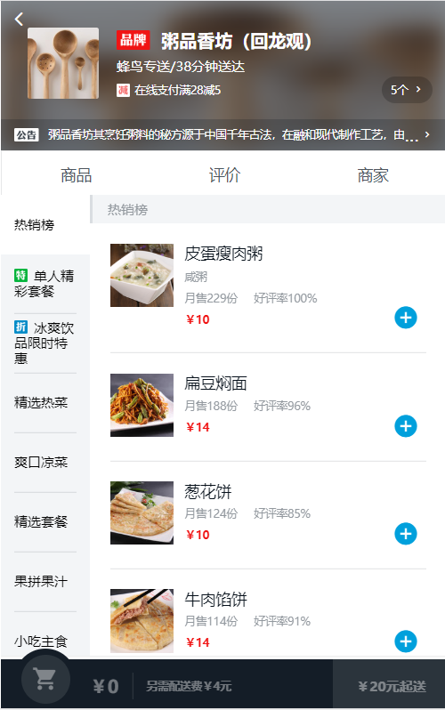

# Eleme
基于Vue@2+vue-cli@2的高仿饿了么移动端项目

## 页面效果
1. 商品详情页

## 项目开发清单

- [x] 页面开发情况
  - [x] 已完成个人中心页
  - [x] 已完成订单页
  - [x] 已完成商品详情页
  - [ ] 待完成首页和发现页
- [x] 完成真机调试，测试结果正常
- [ ] 待完成各页面之间逻辑交互

For a detailed explanation on how things work, check out the [guide](http://vuejs-templates.github.io/webpack/) and [docs for vue-loader](http://vuejs.github.io/vue-loader).
